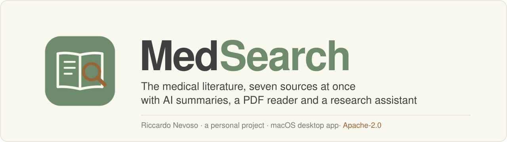
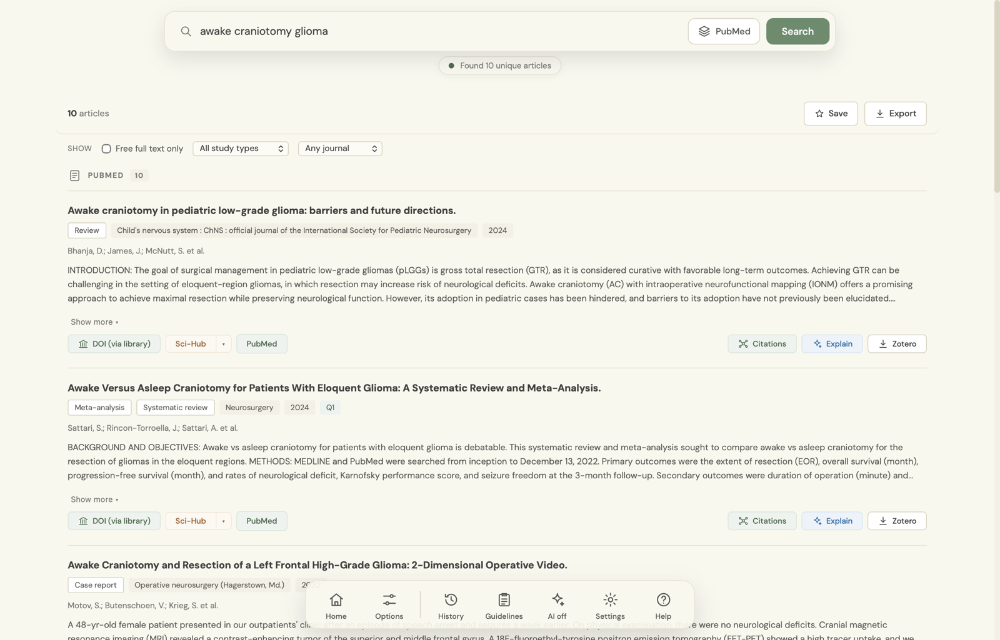

<p align="center">
  
</p>

MedSearch is a desktop application for searching the medical and scientific literature. One
question goes to PubMed, Cochrane, ClinicalTrials.gov, arXiv, Scopus, Web of Science and a
clinical-guidelines source at the same time; the answers come back as one list, with the
duplicates removed, the free full text found where it exists, and retracted papers marked
before anyone quotes them.

It is a personal project by [Riccardo Nevoso](https://github.com/H4lBarAd11), built for
the way clinicians and researchers actually search: one window instead of a dozen browser
tabs.

> [!NOTE]
> **A search tool, not a source of medical advice.** MedSearch finds and organises what has
> been published. The AI summaries, the synthesis and the assistant are aids to reading, and
> they can be wrong: check the paper before relying on anything they say.

<p align="center">
  
</p>

---

## What it does

**One search, every source.** The seven sources are searched in parallel and merged into a
single deduplicated list. Each source reports on its own, so one that fails (a missing key,
an off-campus Scopus) says so in a dialog and the others' results still arrive.

**Guidelines.** A *Guidelines* source finds national and society guidelines indexed in
PubMed, and the *Guidelines* panel opens a country's official body directly (SNLG, NICE,
ECRI, AWMF, HAS and others) with the search already filled in where the site allows it.

**What a result tells you.** Study design (meta-analysis, systematic review, RCT, …),
journal and year, journal quartile for the major journals, citation count, and a
retraction or expression-of-concern warning above the title. The list can be filtered by
study type, by free full text and by quartile, and reordered by relevance or recency.

**Reading the paper.** Open-access PDFs open in a built-in viewer with zoom, fit-to-width
and save. Free copies are found through Unpaywall and OpenAlex. With a library proxy set,
paywalled papers your institution subscribes to open through your library login, in a
browser window inside the app that remembers the login.

**AI, if you want it.** With a Claude API key: a one-line takeaway on every result, a
streamed synthesis across all of them, an *Explain* for any single paper, and a research
assistant that answers from the papers on screen and cites them by number. One switch, *AI
on/off* in the bottom bar, turns all of it off.

**Citations and export.** A citation graph for any paper (what it cites, what cites it),
and export to Markdown, BibTeX or RIS, or straight into Zotero.

**From the menu bar.** MedSearch keeps an icon in the macOS menu bar: a quick search from
anywhere, your recent searches, and the default source for quick searches. Closing the
window leaves it there; *Quit* or ⌘Q ends it. Settings can open it at login, window closed,
ready in the menu bar.

---

## Install (macOS)

You need **Python 3.8+** and **Git**, both preinstalled on most Macs (or
`xcode-select --install`).

```bash
git clone https://github.com/H4lBarAd11/MedSearch-by-RN.git
```

Then double-click **`Create Desktop App.command`** in the new folder, once. It sets up the
environment, installs the dependencies and puts a **MedSearch** app on the Desktop. From
then on, that icon is the way in: it opens MedSearch in its own window, with no Terminal.

> If macOS refuses to open the `.command` file the first time ("unidentified developer"),
> right-click it ▸ **Open** ▸ **Open**. Once.

The Desktop app is only a launcher: MedSearch runs from the folder you cloned, which is
what lets it update itself. If you move that folder, run `Create Desktop App.command` again.

## Updates

When MedSearch opens, it compares its `VERSION` with the one on GitHub. If GitHub's is
newer it offers **Update now**, which downloads the new version, installs any new
dependencies and restarts the app. Nothing else needs doing: the launcher and the menu bar
item are part of what updates.

A new version is offered only when `VERSION` goes up, so a change meant to reach other
Macs is released by raising it.

## Other ways to run it

```bash
cd MedSearch-by-RN
pip install -r requirements.txt
python3 app.py
```

This works on macOS, Windows and Linux; without the native-window library it opens in the
browser instead. `MedSearch.command` does the same on macOS with the Terminal visible,
which is useful when something needs diagnosing. The menu bar item and the Desktop
launcher are macOS-only.

A self-contained macOS bundle, with Python inside, can be built with
`python3 setup_main.py py2app`. It cannot update itself, so the git clone is the
recommended install.

---

## API keys

The free sources need no keys: PubMed, Cochrane, ClinicalTrials.gov and arXiv work out of
the box. Keys are added in **Settings** (bottom bar), stored only in
`~/.medsearch/config.json`, and never leave the machine.

| Key | Where to get it | What it unlocks |
|---|---|---|
| **Anthropic (Claude)** | [console.anthropic.com](https://console.anthropic.com) | The AI features: summaries, synthesis, Explain, the assistant |
| **NCBI / PubMed** | [ncbi.nlm.nih.gov/account](https://ncbi.nlm.nih.gov/account) | A higher PubMed rate limit (10 requests a second instead of 3) |
| **Scopus** | [dev.elsevier.com](https://dev.elsevier.com) | Scopus as a source |
| **Web of Science** | [developer.clarivate.com](https://developer.clarivate.com) | Web of Science as a source |
| **Unpaywall** | any valid email address | Better detection of free full text |

> [!IMPORTANT]
> **Scopus and Web of Science answer only from a subscribing institution's network.** They
> authenticate by address as well as by key: off-campus they return *401*. Use the
> institution's VPN, or ask its library for an Elsevier *institutional token*, which has its
> own field in Settings.

## Institutional library access

In **Settings → Institutional libraries**, add your library's proxy address (EZProxy or
OpenAthens). To find it, open any journal article *through your library's website* while
off-campus and copy what appears in front of the publisher's address, for example
`ezproxy.library.example.edu`. Both the host-rewriting kind and a `…?url=` login prefix
work. Several libraries can be saved; the active one is chosen under **Options**.

Papers then show **DOI (via library)**, which opens them in a browser window inside
MedSearch that carries your library login, so subscribed papers load directly.

## What the AI costs

The one-line summaries use the smallest Claude model, the assistant reuses a cached,
trimmed context from one question to the next, and every answer is capped. A typical
conversation with the assistant costs a few cents.

## Privacy

Everything runs on your machine. Searches, keys, history and saved searches stay in
`~/.medsearch/`. The only traffic out is to the literature services you search and, with
AI on, to the Anthropic API.

---

## Project layout

```
MedSearch-by-RN/
├── app.py                    the backend (Flask) and the native window
├── statusbar.py              the macOS menu bar item
├── launcher.sh               how the Desktop app starts MedSearch (updates with it)
├── Create Desktop App.command  one-time macOS install
├── MedSearch.command         the same start, with the Terminal visible
├── templates/index.html      the page
├── static/css, static/js     its style and behaviour
├── static/fonts, vendor/     DM Sans (OFL) and PDF.js, bundled so it works offline
├── tests/                    pytest suite  (pip install -r requirements-dev.txt)
├── scripts/make-readme-art.py  draws docs/readme/banner.svg from the app's own style
├── render_icon.py            draws the app icon's artwork (icon.icns is built from it)
├── render_menubar_icon.py    draws the menu bar glyph's variants (menubar_icon.png)
├── setup_main.py             optional self-contained bundle (py2app)
└── VERSION                   what the update check compares
```

---

## Troubleshooting

**Scopus or Web of Science return 401.** You are off the institution's network: use its VPN,
or add an Elsevier institutional token in Settings.

**A PDF opens in a browser window instead of the viewer.** The link leads to a publisher's
page rather than to a PDF file. MedSearch opens it in its own browser window, where your
library login applies.

**PubMed answers with HTTP 429.** Too many requests: add a free NCBI key in Settings.

**A key doesn't seem to take effect.** Enter it again in Settings and press Save; restart
MedSearch if it still doesn't.

**"Externally managed environment" from pip.** Use a virtual environment:

```bash
python3 -m venv .venv && source .venv/bin/activate
pip install -r requirements.txt
```

---

## Open science

MedSearch exists to widen access to the literature, not to gate it. It is free, its source
is open, it looks for the open-access copy first, and it works with the subscriptions its
users already have. Contributions in the same spirit are welcome.

## Licence

**Apache License 2.0.** You may use, study, modify and redistribute it, commercially too,
provided the copyright and licence notices are kept and significant changes are stated. The
licence includes an explicit patent grant. See [`LICENSE`](LICENSE) and
[`NOTICE`](NOTICE).

MedSearch queries literature services on your behalf and does not redistribute their
content. All article data belongs to its publishers and providers, and using those
services is subject to their own terms.

Copyright © 2026 Riccardo Nevoso.
