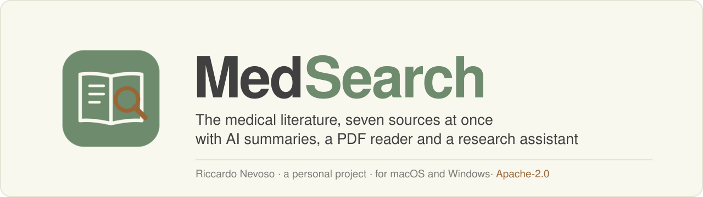
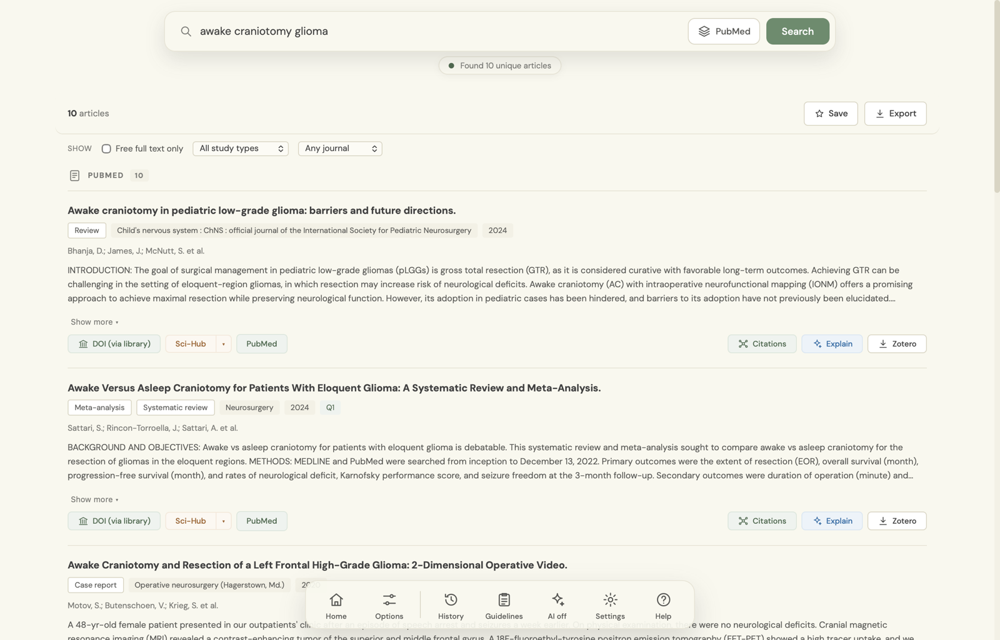

<p align="center">
  
</p>

MedSearch is a desktop application for searching the medical and scientific literature. One
question goes to PubMed, Cochrane, ClinicalTrials.gov, arXiv, Scopus, Web of Science and a
clinical-guidelines source at the same time; the answers come back as one list, with the
duplicates removed, the free full text found where it exists, and retracted papers marked
before anyone quotes them.

It is a personal project by [Riccardo Nevoso](https://github.com/H4lBarAd11), built for
the way clinicians and researchers actually search: one window instead of a dozen browser
tabs.

> [!NOTE]
> **A search tool, not a source of medical advice.** MedSearch finds and organises what has
> been published. The AI summaries, the synthesis and the assistant are aids to reading, and
> they can be wrong: check the paper before relying on anything they say.

<p align="center">
  
</p>

---

## What it does

**One search, every source.** The seven sources are searched in parallel and merged into a
single deduplicated list. Each source reports on its own, so one that fails (a missing key,
an off-campus Scopus) says so in a dialog and the others' results still arrive.

**Search by DOI.** Paste a DOI, a doi.org link or a link to the article, or several DOIs at
once, and each ticked source looks those papers up by DOI. Years and Strict don't apply. A
paper none of them has is shown from Crossref, and a DOI that nobody knows is reported.

**Guidelines.** A *Guidelines* source finds national and society guidelines indexed in
PubMed, and the *Guidelines* panel opens a country's official body directly (SNLG, NICE,
ECRI, AWMF, HAS and others) with the search already filled in where the site allows it.

**What a result tells you.** Study design (meta-analysis, systematic review, RCT, …),
journal and year, journal quartile for the major journals, citation count, and a
retraction or expression-of-concern warning above the title. The list can be filtered by
study type, by free full text and by quartile, and reordered by relevance or recency.

**Reading the paper.** Open-access PDFs open in a built-in viewer with zoom, fit-to-width
and save. Free copies are found through Unpaywall and OpenAlex. With a library proxy set,
paywalled papers your institution subscribes to open through your library login, in a
browser window inside the app that remembers the login.

**AI, if you want it.** With a Claude API key: a one-line takeaway on every result, a
streamed synthesis across all of them, an *Explain* for any single paper, and a research
assistant that answers from the papers on screen and cites them by number. One switch, *AI
on/off* in the bottom bar, turns all of it off.

**Citations and export.** A citation graph for any paper (what it cites, what cites it),
and export to Markdown, BibTeX or RIS, or straight into Zotero.

**From the menu bar.** MedSearch keeps an icon in the macOS menu bar, or by the clock on
Windows: a quick search from anywhere, your recent searches, and the default source for
quick searches. Closing the window leaves it there; *Quit* (or ⌘Q on a Mac) ends it.
Settings can open it at login, window closed, ready in the menu bar or by the clock.

---

## Install (macOS)

For macOS 12 Monterey or later, on Intel or Apple silicon. Nothing else is needed: the
app carries its own Python.

1. Download **`MedSearch-<version>-mac.dmg`** from the
   [latest release](https://github.com/H4lBarAd11/MedSearch/releases/latest).
2. Open it and drag **MedSearch** onto **Applications**.
3. Open MedSearch from Applications.

The first time, macOS says it cannot verify the developer, because MedSearch is not
signed with a paid Apple certificate. Once, and only for this download:

- **macOS 15 Sequoia and later:** press **Done**, then open **System Settings ▸ Privacy &
  Security**, scroll down to the message about MedSearch and press **Open Anyway**.
- **macOS 12 to 14:** right-click MedSearch in Applications ▸ **Open** ▸ **Open**.

On macOS 15 and later, MedSearch may also ask to *find devices on local networks*. Either
answer works: searching, the PDF reader and the AI never need it. Allow it only if you open
articles from an address on a hospital or university intranet.

## Install (Windows)

> [!NOTE]
> **New in 1.31.** The Windows version is built and checked automatically with every
> release, but has not yet been used day to day. If something doesn't work, please
> [open an issue](https://github.com/H4lBarAd11/MedSearch/issues).

For Windows 10 and 11, 64-bit. Nothing else is needed, and no administrator rights.

1. Download **`MedSearch-<version>-Setup.exe`** from the
   [latest release](https://github.com/H4lBarAd11/MedSearch/releases/latest).
2. Run it. MedSearch is installed for you alone, with an entry in the Start menu and, unless
   you untick it, an icon on the Desktop.

The first time, Windows warns that it *protected your PC*, because MedSearch is not signed
with a paid certificate. Press **More info ▸ Run anyway**, once. Setup also installs
Microsoft's WebView2, which draws MedSearch's window, on the rare PC that lacks it.

## Updates

When MedSearch opens, and each time its window comes back, it checks GitHub for a newer
version and offers **Update now**. The installed app then downloads the new version, puts
it in place of itself and reopens, which takes a few seconds; the offer appears only once
the new version's installers are published. **Later** puts the offer off until the next
day, and *Settings ▸ Check for updates* asks at any time. The prompt shows what the new
version changes, from [`CHANGELOG.md`](CHANGELOG.md).

A Mac that runs MedSearch from a git clone (the way it was installed before 1.31) is
offered **Move to it** instead: MedSearch is installed into Applications, and the Desktop
icon and *Open at login* open the installed app from then on. Settings, keys, history and
saved searches stay as they are.

A new version is released by raising `VERSION`, with its lines added to `CHANGELOG.md`, and
pushing: GitHub then tests both installers, installs and starts each, and publishes them
as a release.

## Run from source

```bash
git clone https://github.com/H4lBarAd11/MedSearch.git
cd MedSearch
pip install -r requirements.txt
python3 app.py
```

This works on macOS, Windows and Linux; without the native-window library it opens in the
browser instead. On a Mac, double-clicking **`Create Desktop App.command`** once sets up the
environment and puts a launcher on the Desktop that runs this folder with no Terminal, and
**`MedSearch.command`** runs it with the Terminal visible, which helps when something needs
diagnosing. A clone updates itself with git. A clone holding a file named `.development`
is never offered the move to the installed app.

The installers are built with `packaging/build-mac.sh` and `packaging/build-windows.ps1`
(PyInstaller, and Inno Setup on Windows).

---

## API keys

The free sources need no keys: PubMed, Cochrane, ClinicalTrials.gov and arXiv work out of
the box. Keys are added in **Settings** (bottom bar) and never leave the machine: on macOS
they are kept in the **Keychain** (visible in Keychain Access under *MedSearch*, and
revocable from there), and on Windows in **Credential Manager** (*Windows Credentials*, as
*MedSearch/…*), so no key is written to a file. A key saved by an older version is moved
there the next time MedSearch starts. Where there is neither, they stay in
`~/.medsearch/config.json`, which is readable only by its owner.

On a Mac, macOS asks for the login password when MedSearch stores a key, and may keep
asking when it reads one back — a new Keychain item does not yet name the tool allowed to
read it. `bash scripts/keychain-no-prompt.sh` grants that to Apple's own keychain tool and
to nothing else; run it once, and again after saving a new key. Saving other settings never
touches the Keychain, so it never asks.

| Key | Where to get it | What it unlocks |
|---|---|---|
| **Anthropic (Claude)** | [console.anthropic.com](https://console.anthropic.com) | The AI features: summaries, synthesis, Explain, the assistant |
| **NCBI / PubMed** | [ncbi.nlm.nih.gov/account](https://ncbi.nlm.nih.gov/account) | A higher PubMed rate limit (10 requests a second instead of 3) |
| **Scopus** | [dev.elsevier.com](https://dev.elsevier.com) | Scopus as a source |
| **Web of Science** | [developer.clarivate.com](https://developer.clarivate.com) | Web of Science as a source |
| **Unpaywall** | any valid email address | Better detection of free full text |

> [!IMPORTANT]
> **Scopus and Web of Science answer only from a subscribing institution's network.** They
> authenticate by address as well as by key: off-campus they return *401*. Use the
> institution's VPN, or ask its library for an Elsevier *institutional token*, which has its
> own field in Settings.

## Institutional library access

In **Settings → Institutional libraries**, add your library's proxy address (EZProxy or
OpenAthens). To find it, open any journal article *through your library's website* while
off-campus and copy what appears in front of the publisher's address, for example
`ezproxy.library.example.edu`. Both the host-rewriting kind and a `…?url=` login prefix
work. Several libraries can be saved; the active one is chosen under **Options**.

Papers then show **DOI (via library)**, which opens them in a browser window inside
MedSearch that carries your library login, so subscribed papers load directly. A site's
own PDF button there opens the PDF in another MedSearch window, still signed in; a PDF the
site sends as a file is saved to Downloads and opened in Preview (on Windows, in your PDF
app), and any other file is saved there and shown in the Finder (or Explorer).

Tick **Remember sign-in** under a library and MedSearch keeps the username and password
you type on its login page in the **Keychain** (under *MedSearch sign-in*), or on Windows in
**Credential Manager**. The next time
that page opens, the form is filled and sent for you, once; if it comes back, it is filled
and left for you. The sign-in is filled only on an https page of the library's own domain,
shown under the box (`unitn.it` for UniTN), and unticking the box deletes it. The box
starts unticked: on a computer that several people share, a saved sign-in would sign every
one of them in as the first.

## What the AI costs

The one-line summaries use the smallest Claude model, the assistant reuses a cached,
trimmed context from one question to the next, and every answer is capped. A typical
conversation with the assistant costs a few cents.

**Settings shows what it has actually cost this month**, counted from the token usage each
reply reports, broken down by what was asked of it. A **monthly limit** can be set beside
it: once the month's spending reaches it, the AI features stop and say so, and searching
carries on untouched. For a limit that MedSearch itself cannot exceed, give the machine its
own API key in its own Anthropic console workspace and set the spend limit there.

## Privacy

Everything runs on your machine. Searches, keys, history and saved searches stay in
`~/.medsearch/` (on Windows, `.medsearch` in your user folder). The only traffic out is to
the literature services you search and, with AI on, to the Anthropic API.

---

## Project layout

```
MedSearch/
├── app.py                    the backend (Flask) and the native window
├── statusbar.py, tray.py     the macOS menu bar item, and its Windows twin by the clock
├── appmenu.py                what both menus offer
├── splash.py, splash_win.py  the splash, drawn on each system
├── secrets_store.py          the keys: Keychain, or Credential Manager (wincred.py)
├── signins.py                library sign-ins, remembered and filled in
├── article_windows.py        article windows' new tabs and downloads
├── launcher.sh               how a clone's Desktop app starts MedSearch
├── Create Desktop App.command  a clone's one-time macOS setup
├── MedSearch.command         the same start, with the Terminal visible
├── templates/index.html      the page
├── static/css, static/js     its style and behaviour
├── static/fonts, vendor/     DM Sans (OFL) and PDF.js, bundled so it works offline
├── tests/                    pytest suite  (pip install -r requirements-dev.txt)
├── scripts/make-readme-art.py  draws docs/readme/banner.svg from the app's own style
├── render_icon.py            draws the app icon's artwork (icon.icns and icon.ico)
├── render_menubar_icon.py    draws the menu bar glyph's variants (menubar_icon.png)
├── packaging/                the installers: build spec, build scripts, Windows Setup
├── .github/workflows/        builds, checks and publishes both installers
├── CHANGELOG.md              what each version changed (shown in the update prompt)
└── VERSION                   what the update check compares
```

---

## Troubleshooting

**Scopus or Web of Science return 401.** You are off the institution's network: use its VPN,
or add an Elsevier institutional token in Settings.

**A PDF opens in a browser window instead of the viewer.** The link leads to a publisher's
page rather than to a PDF file. MedSearch opens it in its own browser window, where your
library login applies.

**PubMed answers with HTTP 429.** Too many requests: add a free NCBI key in Settings.

**On Windows the window stays empty.** Microsoft's WebView2 is missing or broken: install
the *WebView2 Runtime* from microsoft.com and open MedSearch again.

**A key doesn't seem to take effect.** Enter it again in Settings and press Save; restart
MedSearch if it still doesn't.

**"Externally managed environment" from pip.** Use a virtual environment:

```bash
python3 -m venv .venv && source .venv/bin/activate
pip install -r requirements.txt
```

---

## Open science

MedSearch exists to widen access to the literature, not to gate it. It is free, its source
is open, it looks for the open-access copy first, and it works with the subscriptions its
users already have. Contributions in the same spirit are welcome.

## Licence

**Apache License 2.0.** You may use, study, modify and redistribute it, commercially too,
provided the copyright and licence notices are kept and significant changes are stated. The
licence includes an explicit patent grant. See [`LICENSE`](LICENSE) and
[`NOTICE`](NOTICE).

MedSearch queries literature services on your behalf and does not redistribute their
content. All article data belongs to its publishers and providers, and using those
services is subject to their own terms.

Copyright © 2026 Riccardo Nevoso.
